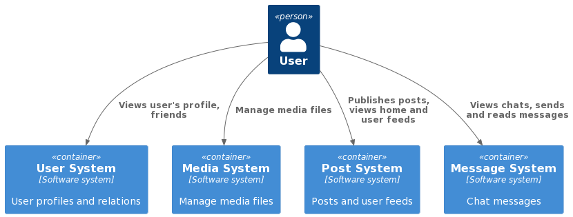

# VK - System Design

### Functional requirements:

- signup, set profile info with photo
- find other users
- add friends
- manage user's posts
- recommendation user's feed
- private and public chats
- show messages seen time

### Non-functional requirements:

- 50 000 000 DAU
- availability 99,95%
- all information (users, messages, posts) stored forever
- service available CIS
- upload size limit - 500 MB
- message and post size limit - 1000 characters
- chat participant limit - 1000 users
- avg messages read per day - 20
- avg messages sent per day - 5
- avg posts read per day - 30
- avg posts sent per day - 3
- avg upload size - 1 MB
- response time for message sending - 1 sec
- response time for message receiving - 5 sec

## Basic calculations

RPS (read) = 50 000 000 \* (20 + 30) / 86 400 = 29 000
RPS (write) = 50 000 000 \* (5 + 3) / 86 400 = 4 600

Traffic per second (write) = 4 600 \* 2000 = 9 200 000 = 9 mb/s
Media traffic per second (write) = 4 600 _ (3 _ 1 000 000) = 13 mb/s
Total traffic per second (write) = 21 mb/s

Total traffic per day (write) = 9 \* 86400 = 1.9 tb/d
Total traffic per year (write) = 1.9 \* 365 = 693 tb/y

Initial storage capacity = 1.3 PB
Initial storage with replication and backups = 2.4 PB

HDD disk capacity = 6 TB
Number of HDD disks with replication = 400
Number of shards = 25 with 2 factor replication

## Design overview

  

